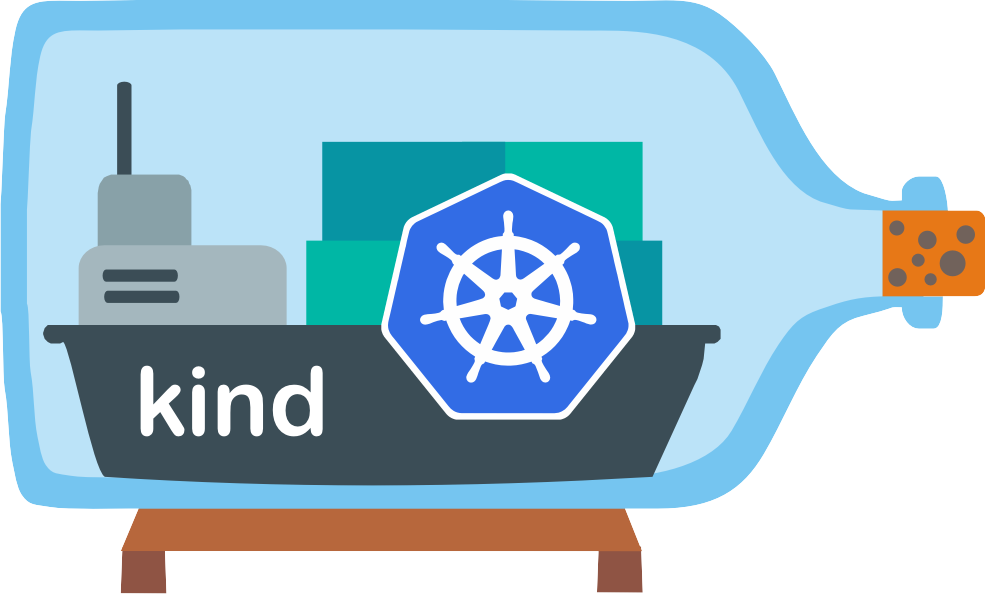
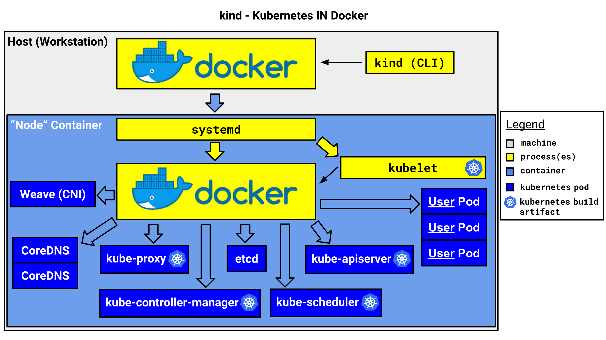
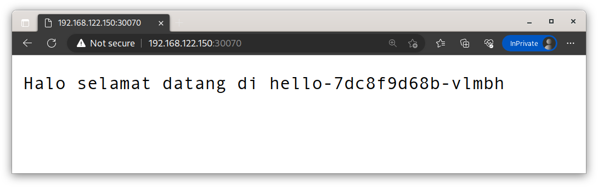

# KIND

https://kind.sigs.k8s.io


**Kind** **K**ubernetes **IN** **D**ocker adalah sebuah tools untuk membuat cluster kubernetes menggunakan container docker sebagai nodes.

**Kind** digunakan untuk testing kubernetes atau untuk local development kubernetes.



Arsitektur Kind



## Installasi Kind

Install Docker Engine terlebih dahulu https://docs.docker.com/engine/install/

Contoh installasi menggunakan script di Linux:

```
curl -fsSL https://get.docker.com -o get-docker.sh
./get-docker.sh
```

Rekomendasi cara untuk menginstall kind: 

1. Menggunakan Package Manager
2. Menggunakan File Binary

### Menggunakan Package Manager

Di MacOS menggunakan Homebrew:

```
brew install kind
```

MacOS menggunakan MacPorts:

```
sudo port selfupdate && sudo port install kind
```

Windows menggunakan (https://chocolatey.org/packages/kind)

```
choco install kind
```

Arch Linux menggunakan [yay](https://github.com/Jguer/yay) atau [paru](https://github.com/Morganamilo/paru) (https://aur.archlinux.org/packages/kind)

```
yay -S kind
paru -S kind
```

### Menggunakan File Binary

Linux (Semua Linux)

```
# Untuk AMD64 / x86_64
[ $(uname -m) = x86_64 ] && curl -Lo ./kind https://kind.sigs.k8s.io/dl/v0.19.0/kind-linux-amd64

# UntukARM64
[ $(uname -m) = aarch64 ] && curl -Lo ./kind https://kind.sigs.k8s.io/dl/v0.19.0/kind-linux-arm64

chmod +x ./kind
sudo mv ./kind /usr/local/bin/kind
```

MacOS

```
# Untuk Mac yang berbasis Intel
[ $(uname -m) = x86_64 ] && curl -Lo ./kind https://kind.sigs.k8s.io/dl/v0.19.0/kind-darwin-amd64

# Untuk M1 / Mac berbasis Arm
[ $(uname -m) = arm64 ] && curl -Lo ./kind https://kind.sigs.k8s.io/dl/v0.19.0/kind-darwin-arm64

chmod +x ./kind
mv ./kind /some-dir-in-your-PATH/kind
```

Windows (di PowerShell)

```
curl.exe -Lo kind-windows-amd64.exe https://kind.sigs.k8s.io/dl/v0.19.0/kind-windows-amd64
Move-Item .\kind-windows-amd64.exe c:\some-dir-in-your-PATH\kind.exe
```

## Membuat Cluster Kubernetes dengan Kind

Membuat cluster dengan nama k8s-dev

```
kind create cluster --name k8s-dev
```

Output:

```
Creating cluster "k8s-dev" ...
 ✓ Ensuring node image (kindest/node:v1.27.1) 🖼
 ✓ Preparing nodes 📦  
 ✓ Writing configuration 📜 
 ✓ Starting control-plane 🕹️ 
 ✓ Installing CNI 🔌 
 ✓ Installing StorageClass 💾 
Set kubectl context to "kind-k8s-dev"
You can now use your cluster with:

kubectl cluster-info --context kind-k8s-dev

Have a question, bug, or feature request? Let us know! https://kind.sigs.k8s.io/#community 🙂
```

Membuat cluster dengan versi kubernetes custom, misal versi 1.26.4 

```
kind create cluster --name k8s-dev2 --image kindest/node:v1.26.4
```

Untuk melihat image yang tersedia silakan kunjungi Docker Hub Kindest (https://hub.docker.com/r/kindest/node/tags)

## Mengakses Cluster Kubernetes

Untuk interaksi dengan cluster kubernetes, kita memerlukan sebuah tool yaitu kubectl (https://kubernetes.io/docs/tasks/tools/)

### Installasi di Linux

```
 curl -LO "https://dl.k8s.io/release/$(curl -L -s https://dl.k8s.io/release/stable.txt)/bin/linux/amd64/kubectl"
```

Versi kustom, misal versi: 1.26.4

```
curl -LO https://dl.k8s.io/release/v1.26.4/bin/linux/amd64/kubectl
```

Beri permission executable dan pindah ke **/usr/local/bin** atau **~/.local/bin**

```
chmod +x kubectl
mv kubectl /usr/local/bin
```

Cek bahwa kubectl telah terinstall, jalankan perintah berikut

```
kubectl version --short
```

Output:

```
Flag --short has been deprecated, and will be removed in the future. The --short output will become the default.
Client Version: v1.27.2
Kustomize Version: v5.0.1
Server Version: v1.26.4
```

Secara default kubectl akan membaca kubeconfig yang ada di **~/.kube/config**

Kubeconfig merupakan file konfigurasi yang berisi kredensial dan alamat cluster kubernetes.

Kubeconfig secara default sudah di generate Kind ketika membuat cluster

Melihat nodes di cluster kubernetes:

```
kubectl get nodes
```

Output:

```
NAME                     STATUS   ROLES           AGE   VERSION
k8s-dev2-control-plane   Ready    control-plane   81m   v1.26.4
````

Mengenal **Contexts** di Kubernetes Cluster

**Contexts** ada di kubeconfig, contexts mendefinisikan user, cluster, namespace yang akan diakses

Melihat semua contexts

```
kubectl config get-contexts
```

Output:

```
CURRENT   NAME            CLUSTER         AUTHINFO        NAMESPACE
          kind-k8s-dev    kind-k8s-dev    kind-k8s-dev    
*         kind-k8s-dev2   kind-k8s-dev2   kind-k8s-dev2 
```

Switch Context 

```
$kubectl config use-context kind-k8s-dev

Switched to context "kind-k8s-dev"
```

Cek nodes lagi

```
kubectl get nodes
```

Output:

```
NAME                    STATUS   ROLES           AGE   VERSION
k8s-dev-control-plane   Ready    control-plane   89m   v1.27.1
```

Outputnya berbeda dengan perintah awal, dikarenakan kita mengubah contexts tadi.

| Contexts       | Cluster  |
|---------------|----------|
| kind-k8s-dev  | k8s-dev  |
| kind-k8s-dev2 | k8s-dev2 |

## Menghapus Cluster Kubernetes

Perintahnya cukup simple

```
kind delete cluster --name kind-k8s-dev
```

Atau 

```
kind delete clusters kind-k8s-dev2
```


## Membuat Multi-Node Cluster Kubernetes

Untuk membuat multi-node cluster kubernetes kita perlu membuat sebuah kind config yang berisi nama node dan jumlah nodenya:

```
kind create cluster --name k8s-arya-multinode --config kind-config.yml
```

[kind-config.yml](kind-config.yml) berisi:

```
kind: Cluster
apiVersion: kind.x-k8s.io/v1alpha4
nodes:
- role: control-plane
- role: worker
- role: worker
```

Cek cluster:

```
kubectl get nodes --context kind-k8s-arya-multinode
```

Output: 

```
NAME                               STATUS   ROLES           AGE     VERSION
k8s-arya-multinode-control-plane   Ready    control-plane   2m10s   v1.27.1
k8s-arya-multinode-worker          Ready    <none>          109s    v1.27.1
k8s-arya-multinode-worker2         Ready    <none>          110s    v1.27.1
```

HA (Multi-Master) [kind-config-ha.yml](kind-config-ha.yml)

```
kind create cluster --name k8s-arya-ha --config kind-config-ha.yml
```

Nodes output:

```
NAME                         STATUS   ROLES           AGE     VERSION
k8s-arya-ha-control-plane    Ready    control-plane   4m      v1.27.1
k8s-arya-ha-control-plane2   Ready    control-plane   3m41s   v1.27.1
k8s-arya-ha-control-plane3   Ready    control-plane   2m47s   v1.27.1
k8s-arya-ha-worker           Ready    <none>          2m36s   v1.27.1
k8s-arya-ha-worker2          Ready    <none>          2m36s   v1.27.1
k8s-arya-ha-worker3          Ready    <none>          2m37s   v1.27.1
```

Mengubah versi kubernetes, cukup tambahkan konfigurasi **image** dibawah **role**

HA(Multi-Master) dengan versi kubernetes 1.26.4 [kind-config-ha-126.yml](kind-config-ha-126.yml)

```
kind create cluster --name k8s-arya-ha-126 --config kind-config-ha-126.yml
```

Nodes output:

```
NAME                             STATUS   ROLES           AGE     VERSION
k8s-arya-ha-126-control-plane    Ready    control-plane   2m34s   v1.26.4
k8s-arya-ha-126-control-plane2   Ready    control-plane   2m9s    v1.26.4
k8s-arya-ha-126-control-plane3   Ready    control-plane   75s     v1.26.4
k8s-arya-ha-126-worker           Ready    <none>          53s     v1.26.4
k8s-arya-ha-126-worker2          Ready    <none>          53s     v1.26.4
k8s-arya-ha-126-worker3          Ready    <none>          52s     v1.26.4
```

## Deploy Aplikasi Sederhana

Disini saya mendeploy aplikasi hello world sederhana, dengan image yang saya bikin sendiri **pramudika/hello**, berikut perintah untuk membuat deployment:

```
kubectl create deployment hello --image pramudika/hello --replicas 3
```

Cek pod nginx:

```
kubectl get pod 
```

Output:

```
NAME                     READY   STATUS    RESTARTS   AGE
hello-78bfc69c5b-km6cn   1/1     Running   0          66s
hello-78bfc69c5b-lrnjz   1/1     Running   0          66s
hello-78bfc69c5b-tx2p7   1/1     Running   0          66s
```

## Mengakses Aplikasi 

Untuk mengakses aplikasi, kita perlu tau IP dari sebuah pod, IP Pod dari Kind merupakan IP Cluster yang ada di dalam container. Jadi untuk mengaksesnya kita perlu akses ke container cluster.

```
docker exec -it k8s-arya-ha-126-control-plane bash
```

Setelah masuk ke container **controlplane** cek IP Pod dengan perintah berikut:

```
root@k8s-arya-ha-126-control-plane:/# kubectl get pod -o wide
```

Output:

```
NAME                     READY   STATUS    RESTARTS   AGE   IP           NODE                      NOMINATED NODE   READINESS GATES
hello-78bfc69c5b-km6cn   1/1     Running   0          94s   10.244.4.5   k8s-arya-ha-126-worker    <none>           <none>
hello-78bfc69c5b-lrnjz   1/1     Running   0          94s   10.244.5.5   k8s-arya-ha-126-worker3   <none>           <none>
hello-78bfc69c5b-tx2p7   1/1     Running   0          94s   10.244.3.5   k8s-arya-ha-126-worker2   <none>           <none>
```

Lakukan curl ke salah satu Pod

```
root@k8s-arya-ha-126-control-plane:/# curl 10.244.4.5
```

Output:

```
Halo selamat datang di hello-78bfc69c5b-km6cn
```

Aplikasi saya akan menampilkan selamat datang dan nama hostname container.

Gimana cara akses ke 3 pod sekaligus? di kubernetes kita perlu objek yang namanya service.

Service ini yang nantinya akan melakukan load balance akses ke 3 Pod.

Perintah membuat service di kubernetes

```
kubectl expose deployment hello --port=80 
```

Cek service:

```
kubectl get service
```

Output:

```
NAME         TYPE        CLUSTER-IP     EXTERNAL-IP   PORT(S)   AGE
hello        ClusterIP   10.96.143.73   <none>        80/TCP    11s
kubernetes   ClusterIP   10.96.0.1      <none>        443/TCP   114m
```

Curl ke IP Service:

```
root@k8s-arya-ha-126-control-plane:/# curl 10.96.143.73

Halo selamat datang di hello-78bfc69c5b-tx2p7

root@k8s-arya-ha-126-control-plane:/# curl 10.96.143.73

Halo selamat datang di hello-78bfc69c5b-lrnjz

root@k8s-arya-ha-126-control-plane:/# curl 10.96.143.73

Halo selamat datang di hello-78bfc69c5b-km6cn
```


Bagaimana agar bisa diakses dari luar cluster?


1. Menggunakan Service NodePort
2. Menggunakan Service LoadBalancer

### NodePort (Tidak direkomendasikan)

nodePort menggunakan port yang dipasang di setiap node dengan range 30000-32767. Jadi kita bisa mengakses aplikasi kita dari luar cluster dengan port tersebut. nodePort bisa diakses dari node manapun.

Berikut gambaran ilustrasinya (bukan cara kerja sebenarnya)!


### nodePort di Kind

Karena node kita ada di docker berarti harus mengekspose port tersebut ketika membuat sebuah cluster

Buat file konfigurasi kind baru

Tambahkan konfigurasi extraPortMappings di file [kind-config-nodePort.yml](kind-config-nodePort.yml) 

```
kind: Cluster
apiVersion: kind.x-k8s.io/v1alpha4
nodes:
- role: control-plane
  extraPortMappings:
  - containerPort: 30080
    hostPort: 30070
- role: worker
- role: worker
```

Buat ulang cluster 

```
kind create cluster --name k8s-arya-ndprt --config kind-config-nodePort.yml
```

Secara default port yang di ekspose di hostPort akan listen ke 0.0.0.0 yang berarti bisa diakses juga dari luar docker host.

Deploy ulang aplikasi seperti sebelumnya

Buat service nodePort dengan file manifest berikut:

[kind-hello-svc-nodePort.yml](kind-hello-svc-nodePort.yml)

```
kubectl apply -f kind-hello-svc-nodePort.yml
```

Akses aplikasi dari service nodePort




### LoadBalancer

Loadbalancer merupakan solusi agar aplikasi kita bisa diakses dengan IP Address secara langsung, jadi tidak menggunakan sebuah port seperti nodePort.


Loadbalancer biasanya di implementasikan di Cloud seperti AWS,GCP,Azure,dll untuk mengekspose aplikasi kita ke internet.

Bagaimana jika cluster kita ada di on premise atau di baremetal?

Kita bisa menggunakan yang namanya [Metallb](https://metallb.universe.tf)

### Metallb di Kind

Untuk installasinya kita cukup jalankan manifest file yang ada di github metallb:

```
kubectl apply -f https://raw.githubusercontent.com/metallb/metallb/v0.13.7/config/manifests/metallb-native.yaml
```

Tunggu semua resource metallb berhasil di deploy, lalu buat 2 komponen 

1. IPAddressPool (Pool IP Address yang akan digunakan oleh service Loadbalancer)
2. L2Advertisement (Mode di metallb untuk memperoleh IP Address, ada metode lain seperti BGP) baca selengkapnya [disini](https://metallb.universe.tf/configuration/)

File manifest metallb, berisi 2 komponen diatas: [metallb-conf](metallb-conf.yml)

Sebelum melakukan apply manifest diatas kita bisa melakukan kustomisasi seperti Range IP Pool

```
apiVersion: metallb.io/v1beta1
kind: IPAddressPool
metadata:
  name: pool-arya
  namespace: metallb-system
spec:
  addresses:
  - 172.18.2.200-172.18.2.205 ##Range IP bisa dirubah
---
apiVersion: metallb.io/v1beta1
kind: L2Advertisement
metadata:
  name: l2-arya
  namespace: metallb-system
```

Karena node kubernetes kita berjalan di docker, kita perlu melihat dulu range IP dockernya. Menggunakan perintah berikut: (Secara default kind membuat network driver baru bernama kind)

```
docker network inspect -f '{{.IPAM.Config}}' kind
```

Output:

```
[{172.18.0.0/16  172.18.0.1 map[]} {fc00:f853:ccd:e793::/64  fc00:f853:ccd:e793::1 map[]}]
```

Contoh output diatas berarti range IP untuk metallbnya yaitu 172.18.0.0/16. Jika bingung mau alokasiin IP nya bisa pakai [IP Calculator](https://jodies.de/ipcalc)

Apply manifest metallb

```
kubectl apply -f metallb-conf.yml
```

Expose aplikasi hello kita tadi dengan perintah berikut

```
kubectl expose deployment hello --name=hello-loadbalancer --port=80 --type=LoadBalancer
```

Lihat service 

```
kubectl get service
```

Output:

```
NAME                 TYPE           CLUSTER-IP      EXTERNAL-IP    PORT(S)        AGE
hello                ClusterIP      10.96.143.73    <none>         80/TCP         34s
hello-loadbalancer   LoadBalancer   10.96.116.222   172.18.2.200   80:32765/TCP   1s
kubernetes           ClusterIP      10.96.0.1       <none>         443/TCP        21h
```

Akses service dari host

```
root@kube-kind:~# curl 172.18.2.200

Halo selamat datang di hello-78bfc69c5b-km6cn
```

## Ingress

Ingress merupakan object di kubernetes yang berfungsi untuk mengakses aplikasi yang ada di service kubernetes dengan menggunakan protokol HTTP. Dengan nama domain/path url di aplikasi tersebut.

Secara umum mirip dengan reverse proxy tapi di pasang di cluster kubernetes.


## Ingress di Kind

Di kind kita perlu menambahkan extraPortMappings ketika membuat cluster (mirip dengan nodePort).

Kita juga perlu menambahkan patch untuk menandai node dengan label "ingress-ready: true"

Tambahkan konfigurasi berikut dibawah control-plane node

Atau bisa lihat file berikut [Kind Config Ingress](kind-config-ingress.yml)

```
 kubeadmConfigPatches:
  - |
    kind: InitConfiguration
    nodeRegistration:
      kubeletExtraArgs:
        node-labels: "ingress-ready=true"
  extraPortMappings:
  - containerPort: 80
    hostPort: 80
    protocol: TCP
  - containerPort: 443
    hostPort: 443
    protocol: TCP
```

### Deploy Ingress

Ada berbagai macam ingress yang bisa digunakan di kubernetes :

1. Nginx Ingress
2. Traefik Ingress
3. HAProxy Ingress
4. Dll.

Kita kan deploy Nginx Ingress karena paling populer dan banyak digunakan

Untuk deploy Nginx ingress di Kind kita bisa langsung apply file manifest dibawah

```
kubectl apply -f https://raw.githubusercontent.com/kubernetes/ingress-nginx/main/deploy/static/provider/kind/deploy.yaml
```

Di file manifest tersebut akan secara otomatis membuat sebuah namespace baru bernama ingress-nginx

Tunggu semua pod yang ada di ingress-nginx running

Contoh file manifest service dan ingress aplikasi hello [Hello-Ingress](hello-ingress.yml)

Untuk host/domain bisa diubah

Jalankan file manifest

```
kubectl apply -f hello-ingress.yml
```

Lihat service dan ingress

```
kubectl get service,ingress
```

Output:

```
NAME                 TYPE        CLUSTER-IP    EXTERNAL-IP   PORT(S)   AGE
service/hello-svc    ClusterIP   10.96.66.65   <none>        80/TCP    94s
service/kubernetes   ClusterIP   10.96.0.1     <none>        443/TCP   19h

NAME                                      CLASS   HOSTS     ADDRESS     PORTS   AGE
ingress.networking.k8s.io/hello-ingress   nginx   pram.id   localhost   80      94s
```

### Pengujian

Buat nama domain dengan mengedit file hosts. Kalau di linux ada di /etc/hosts

Tambahkan IP Host dan nama domain

```
192.168.122.76	pram.id
```

Akses dari browser


